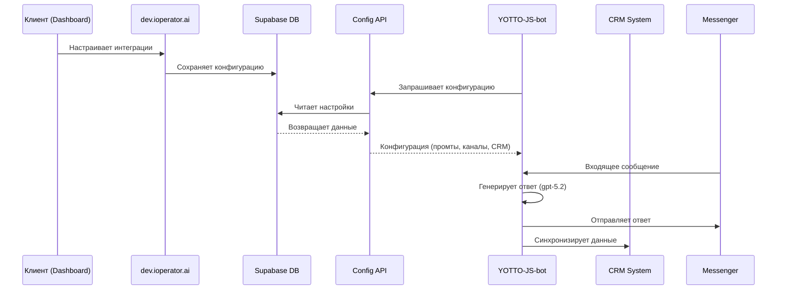

# Дизайн-документ: Модульная архитектура интеграций бота

## Обзор

Данный документ описывает техническую архитектуру модульной системы интеграций для платформы iOperator.ai.

### Концепция проекта

YOTTO-JS-bot трансформируется в универсальный модуль **iOperator Bot Engine** — базовую платформу для всех клиентов системы. Каждый клиент (включая сам iOperator.ai для демо-чата на сайте) является отдельным "tenant" этой системы и может:
- Подключать свои CRM-системы
- Настраивать каналы связи (мессенджеры)
- Кастомизировать промты и поведение бота

**iOperator.ai как клиент**: Демонстрационный чат на сайте iOperator.ai также работает через этот универсальный бот, принимая заявки и отправляя их в CRM — это первый и эталонный клиент системы.

### Универсальность платформы

Система поддерживает любые типы бизнеса, где требуется AI-оператор для обработки клиентов:
- **Рестораны и кафе** — приём заказов, бронирование столиков
- **Розничная торговля** — консультации по товарам, оформление заказов
- **Образование** — запись на курсы, консультации по программам
- **Медицина** — запись к врачам, консультации
- **Красота и SPA** — запись на услуги, консультации
- **Недвижимость** — подбор объектов, запись на просмотры
- **Туризм** — бронирование билетов, отелей, туров
- **Любые другие услуги** — универсальная обработка заявок

### Ключевые принципы

1. **Multi-tenant архитектура**: Один Bot Engine обслуживает всех клиентов, изолируя данные через RLS
2. **Разделение ответственности**: Dashboard (dev.ioperator.ai) управляет конфигурацией, Bot Engine выполняет логику
3. **Модульность**: Интеграции добавляются через реестр без изменения кода
4. **Безопасность**: Все токены шифруются, доступ контролируется через RLS
5. **Расширяемость**: Архитектура позволяет легко добавлять новые CRM и каналы

### Архитектура высокого уровня

```
┌─────────────────────────────────────────────────────────────────┐
│                    dev.ioperator.ai (Dashboard)                  │
│                    Multi-tenant Management UI                    │
├─────────────────────────────────────────────────────────────────┤
│  ┌──────────────┐  ┌──────────────┐  ┌──────────────┐          │
│  │ Integrations │  │   Channels   │  │   Prompts    │          │
│  │    Page      │  │    Page      │  │   Editor     │          │
│  └──────┬───────┘  └──────┬───────┘  └──────┬───────┘          │
│         │                 │                 │                   │
│  ┌──────┴─────────────────┴─────────────────┴───────┐          │
│  │              Integration Services                 │          │
│  │  (CRM, Channels, Prompts management)             │          │
│  └──────────────────────┬───────────────────────────┘          │
│                         │                                       │
│  ┌──────────────────────┴───────────────────────────┐          │
│  │                 Supabase Backend                  │          │
│  │  (integrations, channels, prompts tables + RLS)  │          │
│  └──────────────────────┬───────────────────────────┘          │
└─────────────────────────┼───────────────────────────────────────┘
                          │
                    Config API
                          │
┌─────────────────────────┼───────────────────────────────────────┐
│                         ▼                                        │
│  ┌──────────────────────────────────────────────────┐           │
│  │           iOperator Bot Engine                    │           │
│  │  (универсальный модуль для всех клиентов)        │           │
│  │  - Получает конфигурацию по API-ключу            │           │
│  │  - Обрабатывает сообщения через gpt-5.2          │           │
│  │  - Синхронизирует с CRM клиента                  │           │
│  └──────────────────────────────────────────────────┘           │
│                                                                  │
│  Клиенты (tenants):                                             │
│  ├── iOperator.ai Demo (демо-чат на сайте)                      │
│  ├── YOTTO (первый production клиент)                           │
│  ├── Клиент N...                                                │
│  └── ...                                                        │
└─────────────────────────────────────────────────────────────────┘
```

## Архитектура

### Слои системы

1. **Presentation Layer** - React компоненты Dashboard
2. **Service Layer** - TypeScript сервисы для работы с интеграциями
3. **Data Layer** - Supabase таблицы с RLS-политиками
4. **API Layer** - Config API для YOTTO-JS-bot

### Потоки данных



## Компоненты и интерфейсы

### 1. Модели данных (TypeScript интерфейсы)

```typescript
// Типы интеграций
type IntegrationType = 'crm' | 'channel';
type CRMProvider = 'bitrix24' | 'amocrm' | 'hubspot' | 'salesforce';
type ChannelProvider = 'telegram' | 'whatsapp' | 'viber' | 'vk' | 'web_widget';
type IntegrationStatus = 'active' | 'inactive' | 'error' | 'pending';

// Базовый интерфейс интеграции
interface Integration {
  id: string;
  business_id: string;
  type: IntegrationType;
  provider: CRMProvider | ChannelProvider;
  name: string;
  status: IntegrationStatus;
  config: Record<string, unknown>; // Зашифрованные данные
  last_sync_at: string | null;
  error_message: string | null;
  created_at: string;
  updated_at: string;
}

// Метаданные интеграции (для реестра)
interface IntegrationMeta {
  provider: string;
  type: IntegrationType;
  name: string;
  description: string;
  icon: string;
  config_schema: ConfigField[];
  docs_url: string;
}

// Поле конфигурации
interface ConfigField {
  key: string;
  label: string;
  type: 'text' | 'password' | 'url' | 'select';
  required: boolean;
  placeholder?: string;
  options?: { value: string; label: string }[];
  help_text?: string;
}

// Шаблон промта
interface PromptTemplate {
  id: string;
  business_id: string;
  name: string;
  content: string;
  variables: PromptVariable[];
  is_active: boolean;
  version: number;
  created_at: string;
  updated_at: string;
}

// Переменная промта
interface PromptVariable {
  key: string;
  label: string;
  default_value: string;
  source: 'business_profile' | 'menu' | 'custom';
}

// История промтов
interface PromptHistory {
  id: string;
  prompt_id: string;
  content: string;
  version: number;
  changed_by: string;
  created_at: string;
}

// Конфигурация для iOperator Bot Engine
interface BotConfig {
  business_id: string;
  business_name: string;
  business_type: BusinessType;
  prompt: string;
  channels: ChannelConfig[];
  crm: CRMConfig | null;
  catalog: CatalogItem[]; // Универсальный каталог (меню, товары, услуги, курсы и т.д.)
  settings: BotSettings;
}

// Типы бизнеса
type BusinessType = 
  | 'restaurant'      // Рестораны, кафе, доставка еды
  | 'retail'          // Розничная торговля, магазины
  | 'education'       // Курсы, обучение, тренинги
  | 'healthcare'      // Клиники, медицинские услуги
  | 'beauty'          // Салоны красоты, массаж, SPA
  | 'real_estate'     // Недвижимость
  | 'travel'          // Туризм, авиабилеты, отели
  | 'services'        // Общие услуги
  | 'other';          // Другое

// Универсальный элемент каталога (заменяет menu_items)
interface CatalogItem {
  id: string;
  business_id: string;
  name: string;
  description: string | null;
  price: number;
  currency: string;
  category: string | null;
  image_url: string | null;
  available: boolean;
  attributes: Record<string, unknown>; // Дополнительные атрибуты (размер, цвет, длительность и т.д.)
  sort_order: number;
}

interface ChannelConfig {
  provider: ChannelProvider;
  credentials: Record<string, string>;
  enabled: boolean;
}

interface CRMConfig {
  provider: CRMProvider;
  credentials: Record<string, string>;
  sync_contacts: boolean;
  sync_orders: boolean;
}

interface BotSettings {
  language: string;
  timezone: string;
  working_hours: WorkingHours[];
}
```

### 2. Сервисы Dashboard

```typescript
// src/services/integrations.ts
interface IntegrationsService {
  // Получение списка доступных интеграций
  getAvailableIntegrations(): Promise<IntegrationMeta[]>;
  
  // Получение подключенных интеграций бизнеса
  getBusinessIntegrations(businessId: string): Promise<Integration[]>;
  
  // Подключение интеграции
  connectIntegration(
    businessId: string,
    provider: string,
    config: Record<string, string>
  ): Promise<Integration>;
  
  // Проверка подключения
  testConnection(
    provider: string,
    config: Record<string, string>
  ): Promise<{ success: boolean; error?: string }>;
  
  // Отключение интеграции
  disconnectIntegration(integrationId: string): Promise<void>;
  
  // Обновление конфигурации
  updateIntegration(
    integrationId: string,
    config: Record<string, string>
  ): Promise<Integration>;
}

// src/services/prompts.ts
interface PromptsService {
  // Получение активного промта
  getActivePrompt(businessId: string): Promise<PromptTemplate>;
  
  // Сохранение промта
  savePrompt(businessId: string, content: string): Promise<PromptTemplate>;
  
  // Получение истории промтов
  getPromptHistory(businessId: string): Promise<PromptHistory[]>;
  
  // Восстановление версии
  restoreVersion(promptId: string, version: number): Promise<PromptTemplate>;
  
  // Тестирование промта
  testPrompt(
    content: string,
    testMessage: string
  ): Promise<{ response: string }>;
  
  // Валидация промта
  validatePrompt(content: string): Promise<{ 
    valid: boolean; 
    errors: string[];
    variables: string[];
  }>;
}

// src/services/configApi.ts
interface ConfigApiService {
  // Генерация API-ключа для бота
  generateApiKey(businessId: string): Promise<string>;
  
  // Отзыв API-ключа
  revokeApiKey(businessId: string): Promise<void>;
  
  // Получение конфигурации (для бота)
  getBotConfig(apiKey: string): Promise<BotConfig>;
}
```

### 3. React компоненты

```typescript
// Структура страниц Dashboard
src/pages/dashboard/
├── integrations/
│   ├── IntegrationsPage.tsx      // Главная страница интеграций
│   ├── CRMIntegrations.tsx       // Список CRM интеграций
│   ├── ChannelIntegrations.tsx   // Список каналов связи
│   ├── IntegrationCard.tsx       // Карточка интеграции
│   └── IntegrationSetup.tsx      // Форма настройки интеграции
├── prompts/
│   ├── PromptsPage.tsx           // Страница редактора промтов
│   ├── PromptEditor.tsx          // Редактор с подсветкой
│   ├── PromptVariables.tsx       // Панель переменных
│   ├── PromptHistory.tsx         // История версий
│   └── PromptSandbox.tsx         // Песочница для тестирования
├── customers/
│   ├── CustomersPage.tsx         // Список клиентов
│   └── CustomerChat.tsx          // Переписка с клиентом
├── orders/
│   ├── OrdersPage.tsx            // Список заказов
│   └── OrderDetails.tsx          // Детали заказа
└── settings/
    └── ApiKeysPage.tsx           // Управление API-ключами
```

## Модели данных

### Схема базы данных (Supabase)

```sql
-- Реестр доступных интеграций (статические данные)
CREATE TABLE integration_registry (
  id UUID PRIMARY KEY DEFAULT uuid_generate_v4(),
  provider TEXT UNIQUE NOT NULL,
  type TEXT NOT NULL CHECK (type IN ('crm', 'channel')),
  name TEXT NOT NULL,
  description TEXT,
  icon_url TEXT,
  config_schema JSONB NOT NULL DEFAULT '[]',
  docs_url TEXT,
  is_available BOOLEAN DEFAULT true,
  created_at TIMESTAMPTZ DEFAULT NOW()
);

-- Подключенные интеграции клиентов
CREATE TABLE integrations (
  id UUID PRIMARY KEY DEFAULT uuid_generate_v4(),
  business_id UUID REFERENCES business_profiles(id) ON DELETE CASCADE NOT NULL,
  provider TEXT REFERENCES integration_registry(provider) NOT NULL,
  type TEXT NOT NULL CHECK (type IN ('crm', 'channel')),
  name TEXT NOT NULL,
  status TEXT DEFAULT 'pending' CHECK (status IN ('active', 'inactive', 'error', 'pending')),
  config_encrypted BYTEA, -- Зашифрованные учётные данные
  last_sync_at TIMESTAMPTZ,
  error_message TEXT,
  created_at TIMESTAMPTZ DEFAULT NOW(),
  updated_at TIMESTAMPTZ DEFAULT NOW(),
  UNIQUE(business_id, provider)
);

-- Шаблоны промтов
CREATE TABLE prompt_templates (
  id UUID PRIMARY KEY DEFAULT uuid_generate_v4(),
  business_id UUID REFERENCES business_profiles(id) ON DELETE CASCADE NOT NULL,
  name TEXT DEFAULT 'Основной промт',
  content TEXT NOT NULL,
  variables JSONB DEFAULT '[]',
  is_active BOOLEAN DEFAULT true,
  version INTEGER DEFAULT 1,
  created_at TIMESTAMPTZ DEFAULT NOW(),
  updated_at TIMESTAMPTZ DEFAULT NOW()
);

-- История изменений промтов
CREATE TABLE prompt_history (
  id UUID PRIMARY KEY DEFAULT uuid_generate_v4(),
  prompt_id UUID REFERENCES prompt_templates(id) ON DELETE CASCADE NOT NULL,
  content TEXT NOT NULL,
  version INTEGER NOT NULL,
  changed_by UUID REFERENCES profiles(id),
  created_at TIMESTAMPTZ DEFAULT NOW()
);

-- API-ключи для YOTTO-JS-bot
CREATE TABLE bot_api_keys (
  id UUID PRIMARY KEY DEFAULT uuid_generate_v4(),
  business_id UUID REFERENCES business_profiles(id) ON DELETE CASCADE NOT NULL UNIQUE,
  api_key_hash TEXT NOT NULL, -- Хэш ключа (сам ключ не хранится)
  last_used_at TIMESTAMPTZ,
  created_at TIMESTAMPTZ DEFAULT NOW(),
  revoked_at TIMESTAMPTZ
);

-- Логи событий интеграций
CREATE TABLE integration_logs (
  id UUID PRIMARY KEY DEFAULT uuid_generate_v4(),
  integration_id UUID REFERENCES integrations(id) ON DELETE CASCADE NOT NULL,
  event_type TEXT NOT NULL,
  payload JSONB,
  status TEXT CHECK (status IN ('success', 'error')),
  error_message TEXT,
  created_at TIMESTAMPTZ DEFAULT NOW()
);

-- RLS политики
ALTER TABLE integrations ENABLE ROW LEVEL SECURITY;
ALTER TABLE prompt_templates ENABLE ROW LEVEL SECURITY;
ALTER TABLE prompt_history ENABLE ROW LEVEL SECURITY;
ALTER TABLE bot_api_keys ENABLE ROW LEVEL SECURITY;
ALTER TABLE integration_logs ENABLE ROW LEVEL SECURITY;

-- Политика: владелец бизнеса может управлять интеграциями
CREATE POLICY "Owner manages integrations" ON integrations
  FOR ALL USING (
    business_id IN (SELECT id FROM business_profiles WHERE user_id = auth.uid())
  );

-- Политика: владелец бизнеса может управлять промтами
CREATE POLICY "Owner manages prompts" ON prompt_templates
  FOR ALL USING (
    business_id IN (SELECT id FROM business_profiles WHERE user_id = auth.uid())
  );

-- Политика: владелец видит историю промтов
CREATE POLICY "Owner views prompt history" ON prompt_history
  FOR SELECT USING (
    prompt_id IN (
      SELECT id FROM prompt_templates 
      WHERE business_id IN (SELECT id FROM business_profiles WHERE user_id = auth.uid())
    )
  );

-- Политика: владелец управляет API-ключами
CREATE POLICY "Owner manages api keys" ON bot_api_keys
  FOR ALL USING (
    business_id IN (SELECT id FROM business_profiles WHERE user_id = auth.uid())
  );

-- Индексы
CREATE INDEX idx_integrations_business_id ON integrations(business_id);
CREATE INDEX idx_integrations_provider ON integrations(provider);
CREATE INDEX idx_prompt_templates_business_id ON prompt_templates(business_id);
CREATE INDEX idx_prompt_history_prompt_id ON prompt_history(prompt_id);
CREATE INDEX idx_integration_logs_integration_id ON integration_logs(integration_id);
CREATE INDEX idx_integration_logs_created_at ON integration_logs(created_at);
```

### Начальные данные реестра интеграций

```sql
-- CRM интеграции
INSERT INTO integration_registry (provider, type, name, description, icon_url, config_schema, docs_url, is_available) VALUES
('syrve', 'crm', 'Syrve (iiko Cloud)', 'Интеграция с Syrve для ресторанов и кафе (уже реализована в Bot Engine)', '/icons/syrve.svg',
  '[{"key": "api_login", "label": "API Login", "type": "text", "required": true},
    {"key": "organization_id", "label": "Organization ID", "type": "text", "required": true}]',
  'https://api-ru.syrve.live/swagger/ui/index', true),

('iiko', 'crm', 'iiko', 'Интеграция с iiko для ресторанного бизнеса', '/icons/iiko.svg',
  '[{"key": "api_login", "label": "API Login", "type": "text", "required": true}]',
  'https://api-ru.iiko.services/', true),

('bitrix24', 'crm', 'Bitrix24', 'Интеграция с Bitrix24 CRM для синхронизации контактов и сделок', '/icons/bitrix24.svg', 
  '[{"key": "webhook_url", "label": "Webhook URL", "type": "url", "required": true, "help_text": "URL вебхука из настроек Bitrix24"}]',
  'https://dev.1c-bitrix.ru/rest_help/', true),
  
('amocrm', 'crm', 'AmoCRM', 'Интеграция с AmoCRM для управления воронкой продаж', '/icons/amocrm.svg',
  '[{"key": "subdomain", "label": "Поддомен", "type": "text", "required": true, "placeholder": "yourcompany"},
    {"key": "client_id", "label": "Client ID", "type": "text", "required": true},
    {"key": "client_secret", "label": "Client Secret", "type": "password", "required": true}]',
  'https://www.amocrm.ru/developers/', true),

('hubspot', 'crm', 'HubSpot', 'Интеграция с HubSpot CRM', '/icons/hubspot.svg',
  '[{"key": "api_key", "label": "API Key", "type": "password", "required": true}]',
  'https://developers.hubspot.com/', true),

('salesforce', 'crm', 'Salesforce', 'Интеграция с Salesforce CRM', '/icons/salesforce.svg',
  '[{"key": "instance_url", "label": "Instance URL", "type": "url", "required": true},
    {"key": "client_id", "label": "Consumer Key", "type": "text", "required": true},
    {"key": "client_secret", "label": "Consumer Secret", "type": "password", "required": true}]',
  'https://developer.salesforce.com/', true);

-- Каналы связи
INSERT INTO integration_registry (provider, type, name, description, icon_url, config_schema, docs_url, is_available) VALUES
('telegram', 'channel', 'Telegram', 'Подключение Telegram бота (уже реализовано в Bot Engine)', '/icons/telegram.svg',
  '[{"key": "bot_token", "label": "Bot Token", "type": "password", "required": true, "help_text": "Токен от @BotFather"}]',
  'https://core.telegram.org/bots', true),

('whatsapp', 'channel', 'WhatsApp', 'Интеграция с WhatsApp Business API (уже реализовано в Bot Engine)', '/icons/whatsapp.svg',
  '[{"key": "phone_number_id", "label": "Phone Number ID", "type": "text", "required": true},
    {"key": "access_token", "label": "Access Token", "type": "password", "required": true},
    {"key": "webhook_verify_token", "label": "Webhook Verify Token", "type": "text", "required": true}]',
  'https://developers.facebook.com/docs/whatsapp', true),

('instagram', 'channel', 'Instagram Direct', 'Интеграция с Instagram Direct Messages (частично реализовано)', '/icons/instagram.svg',
  '[{"key": "page_id", "label": "Facebook Page ID", "type": "text", "required": true},
    {"key": "access_token", "label": "Access Token", "type": "password", "required": true}]',
  'https://developers.facebook.com/docs/messenger-platform', true),

('viber', 'channel', 'Viber', 'Подключение Viber бота', '/icons/viber.svg',
  '[{"key": "auth_token", "label": "Auth Token", "type": "password", "required": true}]',
  'https://developers.viber.com/', true),

('vk', 'channel', 'ВКонтакте', 'Интеграция с сообществом ВКонтакте', '/icons/vk.svg',
  '[{"key": "group_id", "label": "ID группы", "type": "text", "required": true},
    {"key": "access_token", "label": "Access Token", "type": "password", "required": true}]',
  'https://dev.vk.com/', true),

('web_widget', 'channel', 'Веб-виджет', 'Встраиваемый чат-виджет для сайта', '/icons/widget.svg',
  '[{"key": "allowed_domains", "label": "Разрешённые домены", "type": "text", "required": false, "help_text": "Через запятую, например: example.com, shop.example.com"}]',
  NULL, true);
```


## Свойства корректности

*Свойство корректности — это характеристика или поведение, которое должно выполняться для всех допустимых входных данных системы. Свойства служат мостом между человекочитаемыми спецификациями и машинно-проверяемыми гарантиями корректности.*


### Property 1: Схема интеграции содержит все обязательные поля

*Для любой* интеграции в реестре, её config_schema должна содержать все поля, необходимые для подключения, и форма настройки должна отображать все эти поля.

**Validates: Requirements 1.2, 4.1**

### Property 2: Отключение интеграции деактивирует её

*Для любой* активной интеграции (CRM или канал), после вызова операции отключения, интеграция не должна присутствовать в списке активных и не должна возвращаться в Config API.

**Validates: Requirements 1.6, 2.6**

### Property 3: Credentials шифруются при хранении

*Для любых* сохранённых учётных данных интеграции (API-ключи, токены, секреты), данные в базе должны быть зашифрованы и не должны храниться в plaintext.

**Validates: Requirements 1.7, 7.1**

### Property 4: Config API возвращает полную конфигурацию

*Для любого* валидного API-ключа бота, Config API должен возвращать полную конфигурацию, включающую: активный промт, список активных каналов с credentials, настройки CRM (если подключена), и данные бизнес-профиля.

**Validates: Requirements 2.7, 5.1, 5.2, 5.3**

### Property 5: Валидация промта корректно определяет ошибки

*Для любого* промта, валидатор должен корректно определять наличие или отсутствие обязательных секций и возвращать список ошибок для невалидных промтов.

**Validates: Requirements 3.3**

### Property 6: Подстановка переменных в промт

*Для любого* промта с переменными и набора значений переменных, операция подстановки должна заменить все переменные на соответствующие значения, не оставляя незаменённых плейсхолдеров.

**Validates: Requirements 3.7**

### Property 7: История промтов сохраняется (Round-trip)

*Для любого* сохранённого промта, должна создаваться запись в истории с предыдущей версией, и восстановление версии из истории должно возвращать точно тот же контент.

**Validates: Requirements 3.8**

### Property 8: Изоляция данных по бизнесу

*Для любого* запроса к интеграциям или промтам, результат должен содержать только данные, принадлежащие Business_Profile текущего пользователя, и не должен включать данные других бизнесов.

**Validates: Requirements 4.2, 7.2**

### Property 9: Round-trip сохранения конфигурации интеграции

*Для любой* конфигурации интеграции, сохранение и последующее чтение должны возвращать эквивалентные данные (с учётом того, что credentials возвращаются в маскированном виде).

**Validates: Requirements 4.4, 4.5**

### Property 10: Идемпотентность обработки событий

*Для любого* webhook-события, повторная обработка того же события (с тем же идентификатором) не должна создавать дубликаты данных или повторно выполнять побочные эффекты.

**Validates: Requirements 6.4**

### Property 11: Валидация webhook подписи

*Для любого* входящего webhook-запроса, система должна проверять подпись или токен, и отклонять запросы с невалидной подписью.

**Validates: Requirements 7.3**

### Property 12: Каскадное удаление при удалении аккаунта

*Для любого* удалённого аккаунта пользователя, все связанные данные (интеграции, промты, API-ключи, логи) должны быть удалены, и не должно оставаться orphan-записей.

**Validates: Requirements 7.4**

### Property 13: Отображение предупреждений для проблемных интеграций

*Для любой* интеграции со статусом 'error' или 'pending', Dashboard должен отображать визуальное предупреждение, привлекающее внимание пользователя.

**Validates: Requirements 8.2**

## Обработка ошибок

### Категории ошибок

1. **Ошибки валидации**
   - Невалидные данные конфигурации интеграции
   - Невалидный формат промта
   - Отсутствие обязательных полей

2. **Ошибки подключения**
   - Невалидный API-ключ/токен внешнего сервиса
   - Таймаут подключения к CRM/мессенджеру
   - Недоступность внешнего сервиса

3. **Ошибки авторизации**
   - Невалидный API-ключ бота
   - Попытка доступа к чужим данным
   - Истёкший токен

4. **Ошибки синхронизации**
   - Конфликт данных при синхронизации с CRM
   - Ошибка отправки сообщения в канал
   - Превышение лимитов API

### Стратегии обработки

```typescript
// Типы ошибок
enum IntegrationErrorCode {
  VALIDATION_ERROR = 'VALIDATION_ERROR',
  CONNECTION_FAILED = 'CONNECTION_FAILED',
  AUTH_FAILED = 'AUTH_FAILED',
  RATE_LIMITED = 'RATE_LIMITED',
  EXTERNAL_SERVICE_ERROR = 'EXTERNAL_SERVICE_ERROR',
  CONFIG_INVALID = 'CONFIG_INVALID',
}

interface IntegrationError {
  code: IntegrationErrorCode;
  message: string;
  details?: Record<string, unknown>;
  retryable: boolean;
  retryAfter?: number; // секунды
}

// Retry стратегия для webhook событий
const RETRY_CONFIG = {
  maxAttempts: 3,
  initialDelay: 1000, // 1 секунда
  maxDelay: 30000, // 30 секунд
  backoffMultiplier: 2,
};
```

### Логирование ошибок

Все ошибки интеграций логируются в таблицу `integration_logs` с полной информацией для отладки:
- Тип события
- Payload запроса (без sensitive данных)
- Код ошибки
- Сообщение об ошибке
- Timestamp

## Стратегия тестирования

### Подход к тестированию

Используется двойной подход:
- **Unit-тесты**: Конкретные примеры, edge cases, обработка ошибок
- **Property-тесты**: Универсальные свойства для всех входных данных

### Property-Based Testing

**Библиотека**: fast-check (для TypeScript)

**Конфигурация**:
- Минимум 100 итераций на каждый property-тест
- Каждый тест помечен комментарием с номером свойства из дизайна

**Формат тегов**: `Feature: modular-bot-integrations, Property N: [описание]`

### Примеры property-тестов

```typescript
import fc from 'fast-check';

// Feature: modular-bot-integrations, Property 6: Подстановка переменных в промт
describe('Prompt variable substitution', () => {
  it('should replace all variables with values', () => {
    fc.assert(
      fc.property(
        fc.record({
          template: fc.string(),
          variables: fc.dictionary(fc.string(), fc.string()),
        }),
        ({ template, variables }) => {
          const result = substituteVariables(template, variables);
          // После подстановки не должно остаться плейсхолдеров
          for (const key of Object.keys(variables)) {
            expect(result).not.toContain(`{{${key}}}`);
          }
        }
      ),
      { numRuns: 100 }
    );
  });
});

// Feature: modular-bot-integrations, Property 8: Изоляция данных по бизнесу
describe('Business data isolation', () => {
  it('should only return data for the requesting business', () => {
    fc.assert(
      fc.property(
        fc.uuid(), // businessId
        fc.array(fc.record({ business_id: fc.uuid(), provider: fc.string() })),
        (requestingBusinessId, allIntegrations) => {
          const result = filterByBusiness(allIntegrations, requestingBusinessId);
          // Все результаты должны принадлежать запрашивающему бизнесу
          result.forEach(integration => {
            expect(integration.business_id).toBe(requestingBusinessId);
          });
        }
      ),
      { numRuns: 100 }
    );
  });
});
```

### Unit-тесты

Unit-тесты фокусируются на:
- Конкретных примерах интеграций (Telegram, Bitrix24)
- Edge cases (пустые данные, максимальные значения)
- Обработке ошибок (невалидные токены, таймауты)
- Интеграционных точках между компонентами

### Покрытие тестами

| Компонент | Unit-тесты | Property-тесты |
|-----------|------------|----------------|
| IntegrationsService | ✓ | Properties 1, 2, 9 |
| PromptsService | ✓ | Properties 5, 6, 7 |
| ConfigApiService | ✓ | Properties 4, 8 |
| WebhookHandler | ✓ | Properties 10, 11 |
| SecurityService | ✓ | Properties 3, 12 |
| Dashboard UI | ✓ | Property 13 |
